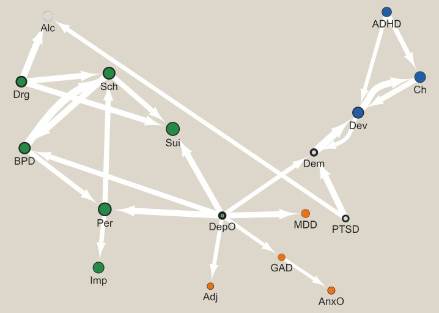
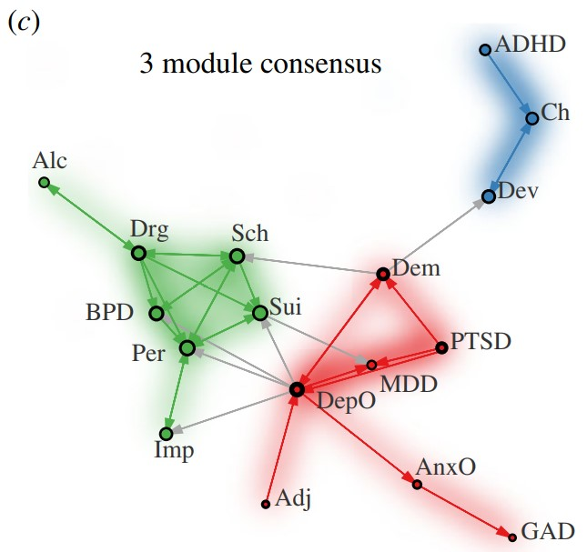

# Projeto 3 - Reproduzindo o Experimento de um Artigo Científico

## Apresentação

O presente projeto foi originado no contexto das atividades da disciplina de pós-graduação [Ciência e Visualização de Dados em Saúde](https://ds4h.org/), oferecida no primeiro semestre de 2022, na Unicamp.

| Nome | RA | Especialização |
| --- | --- | --- |
| Caio Pinheiro Santana | 218653 | Elétrica |
| Bruno Rangel Balbino dos Santos | 218450 | Elétrica |

## Referência bibliográfica do artigo lido

<!-- Coloque aqui a referência bibliográfica do artigo lido, incluindo o link para o site. -->

ALEXANDER-BLOCH, Aaron F. et al. The architecture of co-morbidity networks of physical and mental health conditions in military veterans. Proceedings of the Royal Society A, v. 476, n. 2239, p. 20190790, 2020. Link: http://doi.org/10.1098/rspa.2019.0790.

O artigo foi localizado através do [índice recomendado](https://icon.colorado.edu/#!/networks) na descrição do projeto, filtrando os artigos pelo subdomínio _disease_.

## Resumo

<!-- Escreva um breve resumo do artigo (com as suas palavras, não deve ser copiado texto do artigo). -->

A co-ocorrência de condições médicas e/ou psiquiátricas tem um grande impacto nos custos atrelados à saúde, interferindo na eficácia de tratamentos e criando limitações aos sistemas de classificação diagnóstica, por exemplo. Dessa forma, a ideia do artigo é utilizar diversas condições de saúde como parte de uma rede de comorbidade, na tentativa de detectar e quantificar tendências gerais que não seriam possíveis de se observar utilizando outras abordagens.

Foram utilizados registros eletrônicos de saúde de quase 1 milhão de veteranos militares dos EUA - população escolhida devido ao grande número de registros disponíveis e à desproporcionalidade com a qual é impactada por condições psiquiátricas. Então, extraiu-se 95 condições médicas e psiquiátrias como os nós da rede. A partir de modelos de regressão logística, determinou-se as chances de uma condição afetar o diagnóstico de outra, de modo que as arestas das redes foram formadas por relações positivas e significativas (p < 0.05) entre os pares de condições. Assim, cada aresta representa o aumento do _log odds_ de uma condição dada outra condição, gerando uma rede direcionada.

As forças internas e externas - soma dos pesos das arestas direcionadas para um determinado nó ou saindo dele, respectivamente - foram utilizadas para indicar a capacidade de outras condições em predizer o diagnóstico de uma determinada condição ou a capacidade da condição em questão de predizer o diagnóstico de outras, respectivamente.

Uma detecção de comunidades foi aplicada utilizando o algoritmo de Louvain generalizado e testando diferentes valores para o parâmetro de resolução - que direciona o algoritmo para um número maior ou menor de comunidades. Ainda, para quantificar a comorbidade entre os módulos encontrados, utilizou-se a medida de comorbidade intermódulo normalizada (NIC, do inglês _normalized inter-module co-morbidity_) - definida como a soma dos pesos das arestas de um módulo A para um módulo B, dividida pelo produto do número de nós em cada módulo.

Análises foram realizadas considerando redes de condições psiquiátricas e médicas separadamente. Em ambos os casos, observou-se altos níveis de comorbidade e uma forte estrutura de comunidade hierárquica. Para as condições psiquiátricas, as comunidades se mostraram relativamente estáveis e representativas com 3 e 6 módulos. A partição em 3 módulos incluiu um módulo de condições do desenvolvimento e outros dois mais heterogêneos. Já a partição em 6 módulos, que apresentou subdivisões dos módulos da outra partição, incluiu módulos de uso de substância, depressão/ansiedade e psicose. Os resultados encontrados indicaram que uma relação preditiva da condição A para a B não necessariamente é recíproca (de B para A), de modo que as condições depressão menor, transtorno do estresse pós-traumático e demência se destacaram como preditoras (alta força externa), enquanto o transtorno de uso de alcóol e o transtorno do déficit de atenção com hiperatividade se destacaram pela sua previsibilidade a partir de outras condições (alta força interna).

Já na análise das condições médicas, a partição em 7 módulos se destacou, mapeando os módulos em fenótipos clinicamente relevantes. Essa partição foi formada pelos módulos gastrointestinal, musculoesquelético, sistema hematológico/circulatório, respiratório, doenças infecciosas, neurológico e endócrino/metabólico.

Ao considerar a rede completa com as condições psiquiátricas e médicas em conjunto, observou-se uma clara tendência das condições psiquiátricas como indicadoras de morbidades médicas futuras. Note que, nessa rede, as condições psiquiátricas foram consideradas como um módulo e as condições médicas foram divididas de acordo com a partição em 7 módulos. O módulo neurológico apresentou a evidência mais forte de comorbidade com as condições psiquiátricas, seguido pelos módulos de doenças infecciosas e muscoloesquelético. Arestas específicas que reprentavam uma comorbidade significativa entre condições psiquiátricas e médicas também foram investigadas. As condições psiquiátricas transtorno do estresse pós-traumático, transtorno de uso de substâncias, esquizofrenia, transtornos cognitivos e depressão menor foram significativamente preditivas do maior número de condições médicas. Ainda, as seguintes condições médicas apresentaram forte comorbidade com as condições psiquiátricas: paralisia, lesão intracraniana/lesão cerebral, dor de cabeça, problemas de ouvido, epilepsia/convulsões e doença cerebrovascular.

O estudo também investigou a associação entre distúrbios da dor e as comunidades encontradas, se o sexo dos pacientes está relacionado com um aumento de comorbidade e quantificou a mortalidade de cada condição.

A análise de mortalidade indicou uma relação entre o risco de mortalidade de uma condição e sua centralidade na rede de comorbidade, de modo que condições mais centrais tenderam a apresentar maior risco de morte para os pacientes, especialmente em relação à força interna da condição. Já a análise relativa ao sexo dos pacientes mostrou um aumento de relações de comorbidade específicas de cada sexo, principalmente para os homens. Em especial, o papel do transtorno do estressse pós-traumático como um nó preditor foi aumentado para os homens e esse mesmo papel para os transtornos depressivos foi aumentado para as mulheres.

Por fim, para avaliar uma potencial utilidade clínica da abordagem, utilizou-se uma regressão logística para a predição de esquizofrenia e comportamentos suicidas/autolesivos. A utilização da comorbidade entre todas as outras condições (diagnosticadas antes da condição de interesse) e a condição de interesse aumentou muito a precisão dos modelos em comparação com previsões baseadas em informações demográficas. Para ambas as condições consideradas, a acurácia, sensibilidade e especificidade ficaram em torno de 90%.

O artigo discute que, ao invés de excluídos, indivíduos com múltiplas comorbidades poderiam se tornar o foco de pesquisas futuras. Informações sobre condições médicas e psiquiátricas existentes poderiam ser utilizadas para aumentar a precisão de diagnósticos e levar ao desenvolvimento de tratamentos mais direcionados.

## Breve descrição do experimento/análise do artigo que foi replicado

<!-- Descreva brevemente a parte do artigo cujo experimento ou análise foi reproduzido. Explique o que foi usado como entrada e saída. -->

Dentre os diversos experimentos e análises realizadas no artigo, optamos por tentar replicar:

- __As detecções de comunidades nas redes psiquiátricas e médicas separadamente__. Nessa análise, as matrizes 95x95 de _log odds_ entre os pares de comorbidades e os respectivos p-valores obtidos pela regressão logística foram filtrados para considerar apenas as relações positivas e significativas (p < 0.05), além de subdivididas entre as condições psiquiátricas e médicas, gerando duas matrizes de adjacência utilizadas como entradas para gerar as redes. Desse modo, cada elemento da matriz de adjacências (Aij) continha o aumento do _log odds_ da condição i dada a condição j. Então, aplicou-se o algoritmo de Louvain generalizado, obtendo como saída as comunidades (ou módulos) para cada uma das redes (psiquiátrica ou médica);
- __A análise das condições psiquiátricas como preditoras de outras condições psiquiátricas futuras ou como previsíveis com base em condições psiquiátricas previamente diagnosticadas__. Nesse caso, a rede de condições psiquiátricas foi utilizada como entrada. Então, calculou-se os valores de força interna e externa de cada condição (ou cada nó). Como saída, temos as condições com maior força externa relativa (condições preditoras) ou maior força interna relativa (condições previsíveis), obtidas com base em um gráfico de força externa versus força interna, disponível na figura 2 dos materiais suplementares do artigo;
- __A quantificação de comorbidade entre os módulos__. Como entradas, utilizou-se a matriz de adjacências completa (sem a separação entre condições psiquiátricas e médicas), mas considerando o módulo ao qual cada condição médica pertencia (obtido na primeira análise descrita) e atrelando as condições psiquiátricas a um único módulo diferente desses. Então, calculou-se a NIC entre cada par de módulos. Tais medidas foram utilizadas como saída para quantificar a comorbidade entre os módulos.

Vale notar que consideramos replicar também as análises com respeito ao sexo dos pacientes, que, em tese, teriam seus dados disponibilizados no GitHub atrelado ao artigo. No entanto, ao analisar as tabelas relacionadas ao efeito do sexo nas comorbidades, notamos que elas continham apenas valores iguais a zero, o que impossibilitou a replicação da análise.

### Dados usados como entrada

|      **Dataset**     |               **Endereço na Web**               |                **Resumo descritivo**                |
|:--------------------:|:-----------------------------------------------:|:---------------------------------------------------:|
| Comorbidity Networks | https://github.com/aaronab/comorbidity_networks |<!-- Breve resumo (duas ou três linhas) sobre o dataset. --> O dataset é composto por 4 arquivos .csv na forma de matrizes 95x95, contendo: o _log odds_ de comorbidade da condição i dada a condição j; os respectivos p-valores obtidos pela regressão logística; efeitos de interação do sexo dos pacientes; e seus respectivos p-valores (no entanto, esses dois últimos arquivos possuíam apenas valores iguais a zero). Ainda, foi disponibilizado um arquivo de código em R para uma rápida visualização da rede de comorbidades.|

## Método

<!-- Método usado para a análise -- adaptações feitas, ferramentas utilizadas, abordagens de análise adotadas e respectivos algoritmos. Etapas do processo reproduzido. -->

### Transformação e processamento dos dados

Os arquivos "comorbidity_odds_matrix.csv" (_log odds_) e "comorbidity_pmat_matrix.csv" (p-valores) - disponíveis no GitHub atrelado ao artigo - foram utilizados como base para gerar as redes. No entanto, ambos os arquivos estavam na forma de matrizes 95x95, sendo necessário "achatá-los" para o formato aceito pelo Cytoscape (a ferramenta de processamento de redes utilizada neste projeto), além de descartar os valores da diagonal principal (que relaciona uma condição com ela mesma). Após esse processo, obtivemos duas matrizes: uma com colunas i (relativa às condições das linhas da matriz 95x95), j (relativa às condições das colunas da matriz 95x95) e _log odds_ (_log odds_ de comorbidade da condição i dada a condição j); outra com colunas i, j e os respectivos p-valores.

Essas duas tabelas foram fundidas em uma única e a matriz obtida foi filtrada para considerar apenas as linhas com relações positivas (_Log odds_ > 0, o equivalente a _odds ratio_ > 1) e estatisticamente significativas (p-valor < 0.05), gerando uma matriz com as comorbidades de interesse.

Notamos que a nomeclatura utilizada para as condições era diferente da nomeclatura adotada no artigo para os nós das redes - que consistia em abreviações - além de ser necessário indicar quais condições foram consideradas como psiquiátricas e quais foram consideradas como médicas. No entanto, notamos também que o arquivo de código em R disponível no GitHub (sample_code.R) continha uma lista com as abreviações, bem como uma lista com os índices das condições psiquiátricas. Assim, utilizamos essas duas listas para gerar uma tabela de referência, atrelando o nome da condição no GitHub com sua respectiva abreviação e subgrupo (psiquiátrico ou médico).

Então, substituímos os nomes das condições na matriz de comorbidades de interesse pelas suas respectivas abreviações e criamos mais duas colunas, contendo o subgrupo relacionado à condição i e à condição j. Para obter a tabela relativa à rede de condições psiquiátricas (network_psych.csv), filtramos a matriz de comorbidade de interesse de modo a considerar apenas as linhas nas quais ambas as condições pertenciam ao subgrupo psiquiátrico. Da mesma forma, para obter a matriz relativa à rede de condições médicas (network_medic.csv), consideramos apenas as linhas nas quais ambas as condições pertenciam ao subgrupo médico. Por fim, a tabela relativa à rede completa (network_all.csv) foi gerada considerando todas as linhas da matriz de comorbidades de interesse.

Em todos esses casos, geramos os arquivos utilizando apenas as colunas das condições (i e j) e do _log odds_. Os arquivos podem ser encontrados no diretório /data/processed. Ainda, geramos o arquivo "ref_sub.csv" para ser utilizado em processamentos posteriores. Ele contém a lista de abreviações e seus respectivos subgrupos e pode ser encontrado no diretório /data/interim.

Todas as transformações e processamentos descritos nesta subseção foram realizados por meio do notebook "Network_data.ipynb", disponível no diretório \notebooks.

### Análises da rede de condições psiquiátricas

O arquivo referente à rede de condições psiquiátricas foi importado para o Cytoscape a partir da opção _Import Network from File System_, de modo que a coluna j foi definida como _source node_, a coluna i como _target node_ e a coluna _log odds_ como _edge attribute_. O estilo da rede foi alterado para obter uma rede direcionada e uma melhor visualização dos nomes dos nós. A espessura das arestas foi mapeada para refletir o _log odds_ correspondente, aplicando um mapeamento contínuo. Ainda, aplicamos uma análise de rede para obter alguns dados interessantes sobre ela, indicando que a rede era direcionada.

Como não sabíamos como aplicar o algoritmo de Louvain generalizado através do Cytoscape, nem possuíamos muito conhecimento a respeito dele, optamos por realizar uma detecção de comunidades mais simplificada.

De modo a nos aproximar da análise feita no artigo, tentamos realizar a detecção de comunidades utilizando o algoritmo de Louvain, através do "app" _Community Detection_. Definimos a coluna _log odds_ para ser utilizada como peso das arestas na detecção de comunidades e indicamos que a rede era direcionada. Entretanto, a rede obtida consistiu em apenas uma comunidade composta por dois nós.

Diante do resultado insatisfatório, decidimos aplicar outra metodologia para a detecção de comunidades. Optamos por uma detecção por _edge betweeness_, através do "app" CyFinder. Definimos o _log odds_ para ser utilizado como peso e selecionamos a opção de criar novas redes filhas para as comunidades detectadas. Os resultados obtidos foram mais satisfatórios e relativamente próximos dos obtidos no artigo, portanto, definimos essa abordagem como a escolhida para a detecção de comunidades.

A ideia de _edge betweeness_ pode ser definida como: ao encontrar os menores caminhos entre todos os pares de nós da rede, o _edge betweeness_ de uma aresta é o número desses menores caminhos que incluem a aresta em questão. Ao selecionar um peso (no nosso caso o _log odds_), os valores de _edge betweeness_ são ajustados considerando os pesos das arestas. O algoritmo aplicado pelo CyFinder começa com uma comunidade com todos os nós, remove a aresta com o maior valor de _edge betweeness_, gera como saída os componentes conectados (as comunidades obtidas na iteração) e recalcula os valores, prosseguindo com o processo iterativamente. Ao final do processo, as comunidades com melhor modularidade são obtidas[^1].

Criamos uma nova coluna na tabela de nós (_community_), atribuindo valores diferentes para os nós de cada comunidade encontrada. Então, mapeamos a cor dos nós de forma discreta, de modo que cada conjunto de nós pertencente a uma mesma comunidade possuíssem uma cor específica e atribuindo uma outra cor para os nós que não foram incluídos em nenhuma comunidade.

Passamos então à análise das forças interna e externa de cada nó da rede, que foi realizada através do notebook "Strength_analysis_psych.ipynb" (disponível no diretório \notebooks). Para cada _source node_ (coluna j) da rede, calculamos a soma dos _log odds_ correspondentes de modo a obter a força externa do nó. Do mesmo modo, para cada _target node_ (coluna i) da rede, calculamos a soma dos _log odds_ correspondentes de modo a obter a força interna do nó. Assim, geramos uma tabela relacionando cada nó da rede com sua força interna e externa ("psych_strength.csv", que pode ser encontrada no diretório /data/processed).

Além dos valores absolutos de força interna e externa, tentamos calcular valores relativos. Definimos a força externa relativa como a razão entre as forças externa e interna (ou seja, força externa dividida pela força interna) e, do mesmo modo, a força interna relativa como a razão entre as forças interna e externa (ou seja, força interna dividida pela força externa). A ideia dessas medidas foi quantificar quão maior é a força externa de um nó em relação à sua força interna e vice-versa.

O arquivo de forças internas e externas dos nós foi importado para a tabela de nós da rede no Cytoscape e, de forma semelhante ao que foi feito no artigo, mapeamos o tamanho dos nós de forma contínua com base nos valores de força interna e a espessura da borda dos nós com base nos valores de força externa. Note que, no artigo, a força interna foi na verdade mapeada para o círculo interno colorido, mas não conseguimos realizar tal mapeamento e optamos por utilizar o tamanho do nó.

Como a rede obtida era de difícil visualização devido à grande quantidade de arestas, de forma semelhante ao que foi feito no artigo, encontramos a árvore geradora máxima utilizando o algoritmo de Kruskal através do "app" CyFinder, utilizando os valores de _log odds_ como pesos e selecionando a opção de criar novas redes filhas. O algoritmo de Kruskal simplesmente seleciona as arestas cujos pesos possuem prioridade, nesse caso, os pesos maiores[^1]. Diferentemente do artigo, utilizamos a árvore geradora máxima e não a mínima uma vez que os valores de _log odds_ representam quão forte é a relação de comorbidade entre as condições.

Após obter a árvore geradora máxima, ainda seguindo o que foi feito no artigo, adicionamos a ela os 10% das arestas que possuíam os pesos mais altos. Para isso, exportamos a tabela de nós da árvore geradora máxima obtida (arquivo "network_psych_Kruskal_Max_Spanning_Tree.csv", disponível no diretório /data/interim). Através do notebook "Psych_max_ST_plus_10percent_high_edges.ipynb" (disponível no diretório \notebooks), fizemos a leitura da rede de condições psiquiátricas e da tabela de nós da árvore geradora máxima dessa rede, processamos esta última de modo a obter os nós e seus correspondentes valores de _log odds_ no mesmo formato da primeira, filtramos a tabela da rede de condições psiquiátricas para obter as 10% arestas com pesos mais altos e concatenamos com a tabela da árvore geradora máxima processada (removendo possíveis linhas duplicadas após a concateção).

Tal rede de condições psiquiátricas voltada para uma melhor visualização (arquivo "network_psych_vis.csv", consistindo na árvore geradora máxima + as 10% arestas de maior peso da rede de condições psiquiátricas, disponível no diretório \data\processed) foi então importada para o Cytoscape. Novamente, importamos o arquivo das forças internas e externas dos nós para a tabela de nós dessa nova rede e copiamos manualmente os valores relacionados à comunidade de cada nó, mantendo as mesmas configurações de estilo definidas anteriormente.

Todos os processamentos e análises descritos nesta seção relacionados ao Cytoscape podem ser encontrados no arquivo "network_psych.cys", disponível no diretório /src.

## Resultados

<!-- Apresente os resultados obtidos pela sua adaptação. Confronte os seus resultados com aqueles do artigo. Esta seção opcionalmente pode ser apresentada em conjunto com o método. -->

### Análises da rede de condições psiquiátricas

Após os processamentos realizados, a rede de condições psiquiátricas obtida continha 17 nós e 173 arestas. Ainda, a detecção de comunidades baseada em _edge betweeness_ resultou em três comunidades. A figura abaixo apresenta a rede de condições psiquiátricas completa, sem nenhuma modificação ou filtragem.

Como comentado anteriormente, a espessura das arestas está relacionada com os valores de _log odds_, o tamanho de cada nó está relacionado à sua força interna e a espessura da borda de cada nó à sua força externa. Ainda, os nós verdes, azuis e laranjas destacam as comunidades detectadas, enquanto os nós cinzas não foram incluídos em nenhuma comunidade.

As figuras abaixo apresentam: a árvore geradora máxima + as 10% arestas de maior peso obtida através dos processamentos realizados (primeira figura, mesmas configurações de estilo descritas anteriormente); a rede apresentada no artigo para a partição em 3 módulos (segunda figura, extraída da figura 1 do artigo) que corresponde à árvore geradora mínima + as 10% arestas de maior peso, com as comunidades identificadas pela cor dos nós, área do círculo interno proporcional à força interna e área do anel preto externo proporcional à força externa; a rede apresentada no artigo para a partição em 6 módulos (terceira figura, extraída da figura 1 do artigo, mesmas configurações de estilo da segunda figura).

Para facilitar a comparação, tentamos organizar a posição dos nós da nossa rede de forma semelhante à da rede do artigo. Podemos ver que a rede que geramos, apesar de bastante parecida com a rede apresentada no artigo, possui algumas diferenças. Note, por exemplo, que a nossa rede possui uma aresta ligando os nós ADHD e Dev - que não estava presente na rede do artigo - ou a aresta da nossa rede ligando os nós DepO e Adj - que está presente na rede do artigo, mas na direção contrária. Ainda, a rede do artigo não apresenta nenhum mapeamento relacionado ao peso das arestas (_log odds_), o que acaba dificultando um pouco uma comparação mais consistente.

Quanto às comunidades detectadas, podemos ver que a comunidade destacada em azul foi exatamente a mesma tanto na nossa rede quanto na rede do artigo (independente da quantidade de partições). Ela inclui as condições déficit de atenção com hiperatividade (ADHD), transtornos psiquiátricos infantis (Ch) e transtornos do desenvolvimento (Dev), sendo definida no artigo como módulo do desenvolvimento. A comunidade destacada em laranja na nossa rede se aproximou bastante da comunidade em vermelho detectada no artigo para a partição em 6 módulos - definida como módulo de depressão/ansiedade, por conter transtorno depressivo maior (MDD), depresão menor (DepO), transtorno de ansiedade generalizada (GAD) e outros tipos de ansiedade (AnxO), além dos distúrbios de ajuste (Adj). A única diferença se deu na condição depressão menor (DepO), que não foi incluída na nossa comunidade em laranja, mas estava incluída na comunidade em vermelho na patição em 6 módulos. 

Nossa ideia inicial era de replicar também a detecção de comunidades na rede de condições médicas, bem como realizar a quantificação de comorbidade entre os módulos utilizando a rede completa - inclusive, no notebook que processa os dados para gerar a tabela das redes, geramos arquivos referentes tanto às redes psiquiátricas e médicas separadamente, quanto à rede completa. No entanto, ao realizar a análise para a rede de condições psiquiátricas, acabamos nos deparando com um processo mais trabalhoso do que o esperado e acabamos optando por replicar apenas os experimentos relacionados a ela.

EXPLICAR MELHOR A QUESTÃO DA ÁRVORE GERADORA...

LEMBRAR DE DISCUTIR A QUESTÃO DO ODDS E LOG ODDS E QUE O ARTIGO NÃO DEIXOU SUPER CLARO O QUE FOI CONSIDERADO COMO RELAÇÕES POSITIVAS E TAL...

## Referências

[^1]: TANVIR, Raihanul Bari; MARTIN, Cesar; MONDAL, Ananda Mohan. CyFinder Tutorial. Disponível em: <https://mondallab.cs.fiu.edu/wp-content/uploads/sites/50/2022/02/CyFinder-Tutorial_Final.pdf>.
