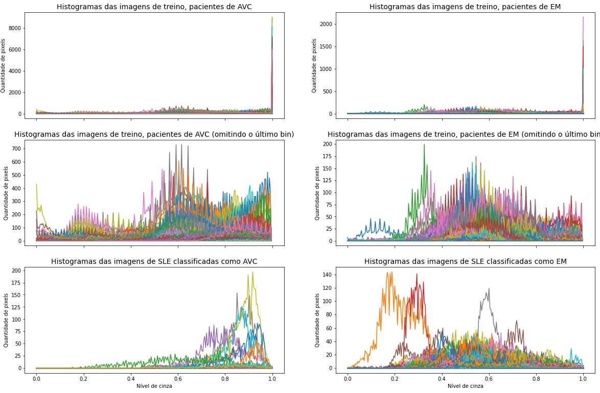

# Projeto 4 – Classificação de lesões de substância branca no Lúpus

<!-- O objetivo geral do projeto é, a partir de uma classificador treinado em imagens de ressonância do cérebro para diferenciar lesões isquêmicas e desmielinizantes, identificar qual a etiologia mais provável das lesões presentes em pacientes de Lúpus Eritematoso Sistêmico (LES).

A equipe pode usar qualquer tipo de classificador para a tarefa, desde o SVM já treinado e entregue na Atividade 11, como outro classificador baseado ou não em DL. Os dados de teste não devem ser incorporados no treinamento do classificador.

O conjunto de dados de lesões de pacientes de LES foram compartilhados pelo Google Drive (link nas instruções do P4 no Classroom).

Para o processamento dos dados e treinamento do classificador, sugere-se usar notebooks (e.g., Jupyter). -->

## Apresentação

O presente projeto foi originado no contexto das atividades da disciplina de pós-graduação [Ciência e Visualização de Dados em Saúde](https://ds4h.org/), oferecida no primeiro semestre de 2022, na Unicamp.

| Nome | RA | Especialização |
| --- | --- | --- |
| Caio Pinheiro Santana | 218653 | Elétrica |
| Bruno Rangel Balbino dos Santos | 218450 | Elétrica |

## Introdução
<!-- Apresentação de forma resumida do problema (contexto) e a pergunta que se quer responder. -->
Parte dos pacientes diagnosticados com Lúpus Eritematoso Sistêmico (SLE) apresentam lesões na substância branca do cérebro que se manifestam através da hiperintensidade do sinal na região da lesão em imagens de ressonância magnética FLAIR ou ponderadas em T2[^1]. Diante da incerteza sobre a etiologia dessas lesões, busca-se identificar sua etiologia mais provável - isquêmica como no Acidente Vascular Cerebral (AVC) ou desmielinizante como na Esclerose Múltipla (EM). Para tal, um classificador SVM foi treinado em imagens de ressonância (FLAIR) do cérebro para diferenciar lesões isquêmicas (pacientes com AVC) e desmielinizantes (pacientes com EM). O melhor modelo obtido foi então aplicado às imagens do cérebro de pacientes com SLE para classificar as lesões e responder às seguintes questões:

* As lesões na substância branca do cérebro de pacientes com SLE se assemelham mais a lesões isquêmicas ou desmielinizantes?
* Quais as características das lesões que possivelmente levaram o classificador a tomar tal decisão?

### Ferramentas
<!-- Listagem das ferramentas utilizadas (na forma de itens). -->

Todos os processamentos deste projeto foram realizados em Python (versão) através de Jupyter Notebooks com o Gooble Colab. Os notebooks podem ser encontrados no diretório /notebooks. (?)

### Preparo e uso dos dados
<!-- Descreva o pipeline de pré-processamento dos dados: normalização (se houver); outros processamentos; uso das máscaras (se houver); extração de atributos (se houver); seleção de atributos (se houver). -->

As imagens de ressonância dos pacientes (AVC ou EM) foram pré-processadas de diferentes formas para avaliar seu impacto na classificação. Realizamos testes com as imagens sem normalização - já que em atividades anteriores não notamos muito impacto na extração de atributos - ou normalizadas por Mínimo e Máximo - escolhida para testes devido à sua simplicidade e ao bom comportamento do intervalo de valores obtidos. Consideramos também as imagens completas ou apenas as regiões de interesse (lesões) definidas pelas máscaras.

Ao analisar os dados, notamos algumas máscaras incorretas - compreendendo mais da metade do cérebro do paciente, as vezes considerando o crânio ou até mesmo o fundo da imagem. Percebemos também que a grande maioria das máscaras possui poucos pixels de região de interesse, mas existem outliers com número muito elevado. Assim, após realizar alguns testes (considerando diferentes thresholds e visualizando as máscaras e imagens correspondentes), acabamos definindo um limite para as regiões de interesse de 30 mil pixels nas imagens de AVC e de 6 mil pixels nas imagens de EM, de modo a excluir as máscaras que apresentam erros gritantes.

Note que não possuímos propriedade suficiente para definir se uma máscara está ou não incorreta, esse processo deveria ser realizado com auxílio de um especialista. No entanto, como nos deparamos com problemas bem sérios em algumas máscaras, optamos por desconsiderar ao menos algumas delas.

Avaliamos atributos baseados em histograma, Matriz de Co-Ocorrência (GLCM) e Matriz de Comprimento de Corrida (RLM). Através de análises anteriores, percebemos que os histogramas das imagens pareciam se assemelhar dentro de cada classe, mas apresentar comportamentos diferentes entre as classes. Dessa forma, focamos inicialmente nos atributos de histograma. Optamos por investigar também se outros atributos de textura (GLCM e RLM) ajudariam na classificação.

Vale destacar que, ao aplicar as máscaras, a extração dos atributos variou um pouco. Para os de histograma, apenas os pixels da imagem correspondentes à região de interesse foram considerados. Já para os atributos de GLCM e RLM, foi necessário definir um bounding box, ou seja, cortar as imagens em retângulos que comportam toda a sua região de interesse, atribuindo intensidade zero aos pixels fora da região. A ideia era extrair atributos com base apenas nas lesões, já que estamos mais interessados em suas características. No entanto, isso não foi possível para os atributos de GLCM e RLM, de modo que a abordagem do bounding box pareceu a mais próxima possível.

Vale discutir depois essa questão do bounding box!!!!!

Os 25 atributos considerados (14 de histograma, 6 de GLCM e 5 de RLM) passaram por um processo de seleção empírica, aplicando diferentes conjuntos de atributos ao classificador e selecionando aqueles que obtiveram os melhores resultados.

## Metodologia
<!-- Descreva o classificador escolhido e o pipeline de treinamento: split dos dados de treinamento; escolha de parâmetros do classificador; validação cruzada; métricas de avaliação; resultados do treinamento do classificador usando tabelas e gráficos.
Justificar as escolhas. Esta parte do relatório pode ser copiada da Atividade 11, caso o grupo opte por usar o SVM já treinado. -->

A partir do conjunto de dados disponibilizado, consideramos apenas as imagens para as quais existe uma máscara correspondente (ou seja, apenas as imagens que certamente apresentam alguma lesão). Dessa forma, o conjunto de treinamento foi composto por 50 pacientes de AVC (581 imagens) e 51 pacientes de EM (630 imagens). Note que, nas análises utilizando as máscaras, o número de pacientes se manteve o mesmo, mas o número de imagens passou a ser 538 de AVC e 611 de EM devido às máscaras excluídas. As imagens de 10 pacientes de cada classe (escolhidos aleatoriamente, cerca de 20% do conjunto) foram separadas em um conjunto de validação. As demais imagens foram utilizadas para uma validação cruzada dos modelos, considerando diferentes pipelines de pré-processamento e parâmetros do classificador.

O classificador utilizado foi um Support Vector Machine (SVM), que procura o hiperplano que melhor divide o espaço de atributos entre as classes. Testamos diferentes kernels (RBF, linear, polinomial e sigmoid) - que mapeiam os atributos para um espaço possivelmente mais linearmente separável pelo hiperplano - mas os primeiros testes indicaram melhor desempenho para o kernel RBF e ele foi fixado para os testes seguintes. Dessa forma, consideramos diferentes valores para os parâmetros C e gamma. O primeiro define a relação entre classificações incorretas no treino e a simplicidade da superfície de decisão, de modo que um C baixo suaviza a superfície e um C alto tenta classificar todo conjunto de treino corretamente. Já o parâmetro gamma define quanta influência um único exemplo de treino possui - quanto maior seu valor, mais próximos devem estar os exemplos e maior o potencial de overfit.

Utilizamos uma validação cruzada com cinco folds. Para cada escolha de normalização e uso de máscara, selecionamos os conjuntos de atributos com melhor desempenho e avaliamos diferentes parâmetros para o SVM. Os modelos que apresentaram melhor desempenho foram treinados em todo o conjunto de validação cruzada e aplicados ao conjunto de validação.

As métricas de avaliação do modelo foram sua acurácia e o recall de cada classe (AVC ou EM). A primeira foi utilizada para fornecer uma visão geral da performance de classificação, enquanto o recall permitiu observar melhor o desempenho em cada classe e seu balanceamento. No caso da validação cruzada, os melhores modelos foram definidos de acordo com as médias das métricas das cinco etapas de treino/validação.

Os atributos de RLM não demonstraram bom desempenho e não foram utilizados pelo classificador final. Já os atributos de histograma realmente se destacaram, principalmente os percentis, a moda e a média. Em especial, o percentil 90 (p90) sozinho obteve mais de 91% de acurácia na validação cruzada não considerando as máscaras e de 93% ao considerá-las - em ambos os casos sem normalização. Além disso, ele estava entre os atributos utilizados por todos os melhores classificadores que obtivemos. Os atributos de GLCM ajudaram pontualmente no desempenho da classificação, mas aliados aos de histograma. Vale ressaltar que o fato de não termos conseguido obter os atributos de GLCM e RLM considerando apenas a região de interesse pode ter afetado significativamente seu comportamento.

Os melhores valores de C e gamma variaram para cada pipeline de pré-processamento avaliada. Por fim, obtivemos melhores resultados com as imagens normalizadas por Mínimo e Máximo e considerando as máscaras. A tabela abaixo apresenta os resultados obtidos pelos modelos aplicados ao conjunto de validação.

TABELA 1 - Características dos melhores modelos e seus resultados de validação.
| Normalização |           Máscaras          |   Atributos de histograma   | Atributos de GLCM |   C  | gamma | Recall AVC | Recall EM | Acurácia |
|:------------:|:---------------------------:|:---------------------------:|:-----------------:|:----:|:-----:|:----------:|:---------:|:--------:|
|      Não     |             Não             |       p90, média e p75      |         -         |   1  | scale |    98.2%   |   78.0%   |   87.3%  |
|      Não     |             Não             | percentis (50, 75, 90 e 99) |         -         | 1000 | scale |    99.1%   |   80.3%   |   89.0%  |
|      Não     |             Sim             |      p90, moda e média      |         -         |  10  | 0.001 |    98.1%   |   83.2%   |   90.3%  |
|      Não     | Sim (histograma) Não (GLCM) |      p90, moda e média      |      contrast     |  100 | 0.001 |    96.3%   |   86.6%   |   91.2%  |
|      Sim     |             Sim             |       p90, moda e p25       |    homogeneity    |  100 | scale |    99.1%   |   87.4%   |   92.9%  |

Dessa forma, o melhor classificador encontrado possuía as seguintes características:

* Imagens normalizadas por Máximo e Mínimo;
* Atributos de histograma considerando a máscara: moda e percentis 90 e 25;
* Atributos de GLCM considerando o bounding box: homogeneity;
* SVM com kernel RBF (default) e C = 100.

Tal classificador foi, então, treinado com todos os dados de treinamento (validação cruzada + validação) para predizer a classe das imagens de teste (225 imagens, uma de cada sujeito). Os resultados obtidos foram: 96.2% de recall para os pacientes de AVC, 99.3% para os pacientes de EM e 98.2% de acurácia. A tabela abaixo apresenta a matriz de confusão correspondente:

TABELA 2 - Matriz de confusão dos resultados no conjunto de teste.

E A TENDÊNCIA DAS IMAGENS OBTIDAS? TALVEZ JÁ COMENTAR AQUI QUE IMAGENS MAIS CLARAS FORAM PRO AVC E TAL...

## Resultados Obtidos e Discussão
<!-- Esta seção deve apresentar o resultado de predição das lesões de LES usando o classificador treinado. Também deve tentar explicar quais os atributos relevantes usados na classificação obtida: apresente os resultados de forma quantitativa e qualitativa; tenha em mente que quem irá ler o relatório é uma equipe multidisciplinar. Descreva questões técnicas, mas também a intuição por trás delas. -->

O melhor classificador obtido foi treinado com todos os dados de treinamento e aplicado ao conjunto de imagens de lesões de SLE. Note que, das 697 imagens do conjunto, quatro possuíam máscaras contendo apenas pixels de valor zero (ou seja, sem uma região de interesse) e foram desconsideradas. Assim, das 693 imagens submetidas ao classificador, 59 foram classificadas como AVC (ou lesões isquêmicas) e 634 como EM (ou lesões desmielinizantes). A figura abaixo apresenta a distribuição dos valores dos atributos para as imagens de SLE em cada classe.

FIGURA 1 - Boxplots com as distribuições dos valores de cada atributo considerado, separadas por classe predita.

PUXAR AQUI OS BOXPLOTS PRA CLASSIFICAÇÃO DE SLE E SÓ DEPOIS COMENTAR SOBRE O QUE CADA ATRIBUTO REPRESENTA E COMPARAR COM AS ANÁLISES DO TREINO...

Analisando os atributos utilizados pelo modelo, temos que:

* Os atributos de histograma estão atrelados à concentração de pixels em determinadas intensidades. Enquanto a moda indica o nível de cinza que mais se repetiu nos pixels da imagem, os percentis indicam a partir de qual nível de cinza é possível obter determinada porcentagem do total de pixels (no nosso caso, 90 ou 25%). No conjunto de treino, notamos que as imagens de AVC tenderam a apresentar valores mais altos para os três atributos (em especial para a moda e o p90), sugerindo que as lesões isquêmicas tendem a apresentar mais pixels com intensidades mais altas.

* O único atributo de GLCM considerado - a homogeneity - está relacionado à homogeneidade da textura da imagem, de modo que seu valor será maior (máximo 1) se os pixels consecutivos possuírem níveis de cinza mais próximos. No conjunto de treino, não conseguimos notar uma diferença entre as classes ao considerar esse atributo, que tendeu a apresentar valores altos em ambas. AQUI EU PODERIA FALAR DA QUESTÃO DO BOUNDING BOX

De acordo com os resultados de treino e validação, a moda e o p90 foram os atributos mais decisivos para a classificação do nosso modelo, de modo que os demais (p25 e homogeneity) apenas melhoraram ligeiramente seu desempenho.

Para tentar obter uma melhor intuição sobre o que distinguiu as lesões, a figura abaixo apresenta os histogramas das imagens do conjunto de treino e de SLE por classe. Note que, três imagens que apresentaram regiões de interesse desproporcionalmente grandes foram excluídas dessa análise para facilitar a comparação entre os histogramas (já que algumas delas também consideravam pixels do fundo como região de interesse, gerando histogramas desproporcionais aos demais). 

A PARTIR DAÍ, PUXA PROS HISTOGRAMAS JÁ QUE OS ATRIBUTOS DE HISTOGRAMA SE DESTACARAM E SÃO MAIS FÁCEIS DE INTERPRETAR

A figura abaixo apresenta os histogramas das imagens do conjunto de treino e de SLE por classe
Ainda, outras três apresentaram regiões de interesse desproporcionalmente grandes e foram excluídas de algumas análises.

(pq classificou assim? falar dos atributos considerados e sua interpretação, comparar também os histogramas e visualizar as imagens de cada classe)

FIGURA 2 - Histogramas das imagens após a normalização: por classe (AVC ou EM) e conjunto (treino ou SLE). Para facilitar a visualização e comparação, o último bin de cada histograma foi omitido e as três imagens com regiões de interesse muito grandes não foram consideradas.

É possível perceber que as lesões de SLE classificadas como AVC tenderam a apresentar uma maior concentração de pixels com intensidades mais altas

DAÍ VEM A COMPARAÇÃO VISUAL ENTRE AS IMAGENS

LEMBRAR TAMBÉM DA QUESTÃO DA DIFERENÇA DE INTENSIDADES (MÁXIMO DA LESÃO - MÉDIA DA MATÉRIA BRANCA?)

## Conclusão
<!-- Destacar as principais conclusões obtidas no desenvolvimento do projeto.
Destacar os principais desafios enfrentados.
Principais lições aprendidas.
Trabalhos Futuros: o que poderia ser melhorado se houvesse mais tempo? -->

## Referências Bibliográficas
<!-- Lista de artigos, links e referências bibliográficas (se houver).
Fiquem à vontade para escolher o padrão de referenciamento preferido pelo grupo. -->

[^1]: POSTAL, M. et al. Magnetic resonance imaging in neuropsychiatric systemic lupus erythematosus: current state of the art and novel approaches. Lupus, v. 26, n. 5, p. 517-521, 2017.
