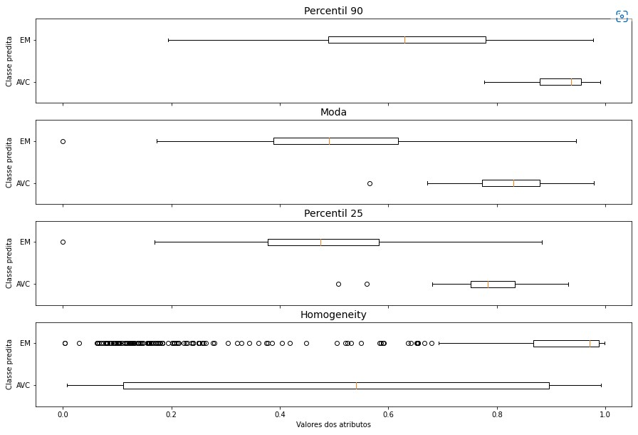
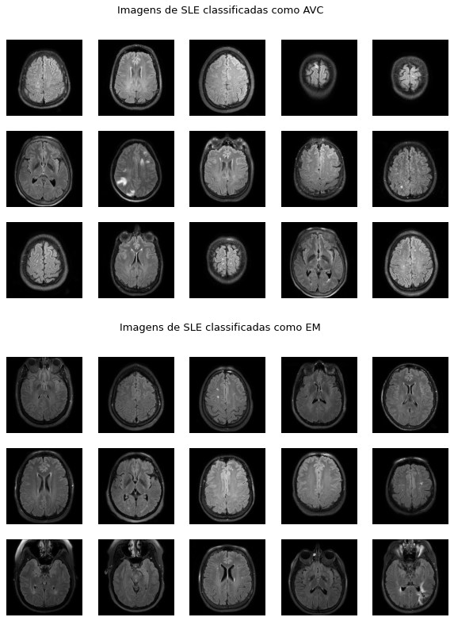

# Projeto 4 – Classificação de lesões de substância branca no Lúpus

<!-- O objetivo geral do projeto é, a partir de uma classificador treinado em imagens de ressonância do cérebro para diferenciar lesões isquêmicas e desmielinizantes, identificar qual a etiologia mais provável das lesões presentes em pacientes de Lúpus Eritematoso Sistêmico (LES).

A equipe pode usar qualquer tipo de classificador para a tarefa, desde o SVM já treinado e entregue na Atividade 11, como outro classificador baseado ou não em DL. Os dados de teste não devem ser incorporados no treinamento do classificador.

O conjunto de dados de lesões de pacientes de LES foram compartilhados pelo Google Drive (link nas instruções do P4 no Classroom).

Para o processamento dos dados e treinamento do classificador, sugere-se usar notebooks (e.g., Jupyter). -->

## Apresentação

O presente projeto foi originado no contexto das atividades da disciplina de pós-graduação [Ciência e Visualização de Dados em Saúde](https://ds4h.org/), oferecida no primeiro semestre de 2022, na Unicamp.

| Nome | RA | Especialização |
| --- | --- | --- |
| Caio Pinheiro Santana | 218653 | Elétrica |
| Bruno Rangel Balbino dos Santos | 218450 | Elétrica |

## Introdução
<!-- Apresentação de forma resumida do problema (contexto) e a pergunta que se quer responder. -->
Parte dos pacientes diagnosticados com Lúpus Eritematoso Sistêmico (SLE) apresentam lesões na substância branca do cérebro que se manifestam através da hiperintensidade do sinal na região da lesão em imagens de ressonância magnética FLAIR ou ponderadas em T2[^1]. Diante da incerteza sobre a etiologia dessas lesões, busca-se identificar sua etiologia mais provável - isquêmica como no Acidente Vascular Cerebral (AVC) ou desmielinizante como na Esclerose Múltipla (EM). Para tal, um classificador SVM foi treinado em imagens de ressonância (FLAIR) do cérebro para diferenciar lesões isquêmicas (pacientes com AVC) e desmielinizantes (pacientes com EM). O melhor modelo obtido foi então aplicado às imagens do cérebro de pacientes com SLE para classificar as lesões e responder às seguintes questões:

* As lesões na substância branca do cérebro de pacientes com SLE se assemelham mais a lesões isquêmicas ou desmielinizantes?
* Quais as características das lesões que possivelmente levaram o classificador a tomar tal decisão?

### Ferramentas
<!-- Listagem das ferramentas utilizadas (na forma de itens). -->

Todos os processamentos deste projeto foram realizados em Python (versão 3.7.13) através de Jupyter Notebooks com o Gooble Colab. Os notebooks utilizados podem ser encontrados no diretório /notebooks.

### Preparo e uso dos dados
<!-- Descreva o pipeline de pré-processamento dos dados: normalização (se houver); outros processamentos; uso das máscaras (se houver); extração de atributos (se houver); seleção de atributos (se houver). -->

As imagens de ressonância dos pacientes (AVC ou EM) foram pré-processadas de diferentes formas para avaliar seu impacto na classificação. Realizamos testes com as imagens sem normalização - já que em atividades anteriores não notamos muito impacto na extração de atributos - ou normalizadas por Mínimo e Máximo - escolhida para testes devido à sua simplicidade e ao bom comportamento do intervalo de valores obtidos. Consideramos também as imagens completas ou apenas as regiões de interesse (lesões) definidas pelas máscaras.

Ao analisar os dados, notamos algumas máscaras incorretas - compreendendo mais da metade do cérebro do paciente, as vezes considerando o crânio ou até mesmo o fundo da imagem. Percebemos também que a grande maioria das máscaras possui poucos pixels de região de interesse, mas existem outliers com número muito elevado. Assim, após realizar alguns testes (considerando diferentes thresholds e visualizando as máscaras e imagens correspondentes), acabamos definindo um limite para as regiões de interesse de 30 mil pixels nas imagens de AVC e de 6 mil pixels nas imagens de EM, de modo a excluir as máscaras que apresentam erros gritantes.

Note que não possuímos propriedade suficiente para definir se uma máscara está ou não incorreta, esse processo deveria ser realizado com auxílio de um especialista. No entanto, como nos deparamos com problemas bem sérios em algumas máscaras, optamos por desconsiderar ao menos algumas delas.

Avaliamos atributos baseados em histograma, Matriz de Co-Ocorrência (GLCM) e Matriz de Comprimento de Corrida (RLM). Através de análises anteriores, percebemos que os histogramas das imagens pareciam se assemelhar dentro de cada classe, mas apresentar comportamentos diferentes entre as classes. Dessa forma, focamos inicialmente nos atributos de histograma. Optamos por investigar também se outros atributos de textura (GLCM e RLM) ajudariam na classificação.

Vale destacar que, ao aplicar as máscaras, a extração dos atributos variou um pouco. Para os de histograma, apenas os pixels da imagem correspondentes à região de interesse foram considerados. Já para os atributos de GLCM e RLM, foi necessário definir um bounding box, ou seja, cortar as imagens em retângulos que comportam toda a sua região de interesse, atribuindo intensidade zero aos pixels fora da região. A ideia era extrair atributos com base apenas nas lesões, já que estamos mais interessados em suas características. No entanto, isso não foi possível para os atributos de GLCM e RLM, de modo que a abordagem do bounding box pareceu a mais próxima possível.

Os 25 atributos considerados (14 de histograma, 6 de GLCM e 5 de RLM) passaram por um processo de seleção empírica, aplicando diferentes conjuntos de atributos ao classificador e selecionando aqueles que obtiveram os melhores resultados.

## Metodologia
<!-- Descreva o classificador escolhido e o pipeline de treinamento: split dos dados de treinamento; escolha de parâmetros do classificador; validação cruzada; métricas de avaliação; resultados do treinamento do classificador usando tabelas e gráficos.
Justificar as escolhas. Esta parte do relatório pode ser copiada da Atividade 11, caso o grupo opte por usar o SVM já treinado. -->

A partir do conjunto de dados disponibilizado, consideramos apenas as imagens para as quais existe uma máscara correspondente (ou seja, apenas as imagens que certamente apresentam alguma lesão). Dessa forma, o conjunto de treinamento foi composto por 50 pacientes de AVC (581 imagens) e 51 pacientes de EM (630 imagens). Note que, nas análises utilizando as máscaras, o número de pacientes se manteve o mesmo, mas o número de imagens passou a ser 538 de AVC e 611 de EM devido às máscaras excluídas. As imagens de 10 pacientes de cada classe (escolhidos aleatoriamente, cerca de 20% do conjunto) foram separadas em um conjunto de validação. As demais imagens foram utilizadas para uma validação cruzada dos modelos, considerando diferentes pipelines de pré-processamento e parâmetros do classificador.

O classificador utilizado foi um Support Vector Machine (SVM), que procura o hiperplano que melhor divide o espaço de atributos entre as classes. Testamos diferentes kernels (RBF, linear, polinomial e sigmoid) - que mapeiam os atributos para um espaço possivelmente mais linearmente separável pelo hiperplano - mas os primeiros testes indicaram melhor desempenho para o kernel RBF e ele foi fixado para os testes seguintes. Dessa forma, consideramos diferentes valores para os parâmetros C e gamma. O primeiro define a relação entre classificações incorretas no treino e a simplicidade da superfície de decisão, de modo que um C baixo suaviza a superfície e um C alto tenta classificar todo conjunto de treino corretamente. Já o parâmetro gamma define quanta influência um único exemplo de treino possui - quanto maior seu valor, mais próximos devem estar os exemplos para serem afetados e maior o potencial de overfit [^2][^3].

Utilizamos uma validação cruzada com cinco folds, de modo a manter cerca de 20% dos dados nas validações. Para cada escolha de normalização e uso de máscara, selecionamos os conjuntos de atributos com melhor desempenho e avaliamos diferentes parâmetros para o SVM. Os modelos que apresentaram melhor desempenho foram treinados em todo o conjunto de validação cruzada e aplicados ao conjunto de validação.

As métricas de avaliação do modelo foram sua acurácia e o recall de cada classe (AVC ou EM). A primeira foi utilizada para fornecer uma visão geral da performance de classificação, enquanto o recall permitiu observar melhor o desempenho em cada classe e seu balanceamento. No caso da validação cruzada, os melhores modelos foram definidos de acordo com as médias das métricas das cinco etapas de treino/validação.

Os atributos de RLM não demonstraram bom desempenho e não foram utilizados pelo classificador final. Já os atributos de histograma realmente se destacaram, principalmente os percentis, a moda e a média. Em especial, o percentil 90 (p90) sozinho obteve mais de 91% de acurácia na validação cruzada não considerando as máscaras e de 93% ao considerá-las - em ambos os casos sem normalização. Além disso, ele estava entre os atributos utilizados por todos os melhores classificadores que obtivemos. Os atributos de GLCM ajudaram pontualmente no desempenho da classificação, mas aliados aos de histograma. Vale ressaltar que o fato de não termos conseguido obter os atributos de GLCM e RLM considerando apenas a região de interesse pode ter afetado significativamente seu comportamento.

Os melhores valores de C e gamma variaram para cada pipeline de pré-processamento avaliada. Por fim, obtivemos melhores resultados com as imagens normalizadas por Mínimo e Máximo e considerando as máscaras. A tabela abaixo apresenta os resultados obtidos pelos modelos aplicados ao conjunto de validação.

TABELA 1 - Características dos melhores modelos e seus resultados de validação.
| Normalização |           Máscaras          |   Atributos de histograma   | Atributos de GLCM |   C  | gamma | Recall AVC | Recall EM | Acurácia |
|:------------:|:---------------------------:|:---------------------------:|:-----------------:|:----:|:-----:|:----------:|:---------:|:--------:|
|      Não     |             Não             |       p90, média e p75      |         -         |   1  | scale |    98.2%   |   78.0%   |   87.3%  |
|      Não     |             Não             | percentis (50, 75, 90 e 99) |         -         | 1000 | scale |    99.1%   |   80.3%   |   89.0%  |
|      Não     |             Sim             |      p90, moda e média      |         -         |  10  | 0.001 |    98.1%   |   83.2%   |   90.3%  |
|      Não     | Sim (histograma) Não (GLCM) |      p90, moda e média      |      contrast     |  100 | 0.001 |    96.3%   |   86.6%   |   91.2%  |
|      Sim     |             Sim             |       p90, moda e p25       |    homogeneity    |  100 | scale |    99.1%   |   87.4%   |   92.9%  |

É possível perceber que, de modo geral, os modelos acertaram a classe de praticamente todas as imagens de AVC e tenderam a errar um pouco mais a classificação das imagens de EM. Ainda, o melhor classificador encontrado possuía as seguintes características:

* Imagens normalizadas por Máximo e Mínimo;
* Atributos de histograma considerando a máscara: moda e percentis 90 e 25;
* Atributos de GLCM considerando o bounding box: homogeneity;
* SVM com kernel RBF (default) e C = 100.

De acordo com os resultados de treino e validação, a moda e o p90 foram os atributos mais decisivos para a classificação do nosso modelo, de modo que os demais (p25 e homogeneity) apenas melhoraram ligeiramente seu desempenho.

Tal classificador foi, então, treinado com todos os dados de treinamento (validação cruzada + validação) para predizer a classe das imagens de teste (225 imagens, uma de cada sujeito). Os resultados obtidos foram: 96.2% de recall para os pacientes de AVC, 99.3% para os pacientes de EM e 98.2% de acurácia. Neste caso, curiosamente, o modelo se saiu um pouco melhor na classificação das imagens de EM. A tabela abaixo apresenta a matriz de confusão correspondente:

TABELA 2 - Matriz de confusão dos resultados no conjunto de teste.

## Resultados Obtidos e Discussão
<!-- Esta seção deve apresentar o resultado de predição das lesões de LES usando o classificador treinado. Também deve tentar explicar quais os atributos relevantes usados na classificação obtida: apresente os resultados de forma quantitativa e qualitativa; tenha em mente que quem irá ler o relatório é uma equipe multidisciplinar. Descreva questões técnicas, mas também a intuição por trás delas. -->

O melhor classificador obtido foi treinado com todos os dados de treinamento e aplicado ao conjunto de imagens de lesões de SLE (que passaram pela mesma pipeline de pré-processamento das imagens de treino). Note que, das 697 imagens do conjunto, quatro possuíam máscaras contendo apenas pixels de valor zero (ou seja, sem uma região de interesse) e foram desconsideradas. Assim, das 693 imagens submetidas ao classificador (78 pacientes, várias fatias por paciente), 59 foram classificadas como AVC (ou lesões isquêmicas) e 634 como EM (ou lesões desmielinizantes).

A figura abaixo apresenta a distribuição dos valores de cada atributo utilizado pelo modelo através de boxplots. Apenas as imagens de SLE foram consideradas, separadas de acordo com a classe predita pelo classificador.

FIGURA 1 - Boxplots com as distribuições dos valores de cada atributo considerado das imagens de SLE, separadas por classe predita.

Os atributos de histograma estão atrelados à concentração de pixels em determinadas intensidades. Enquanto a moda indica o nível de cinza que mais se repetiu nos pixels da imagem, os percentis indicam a partir de qual nível de cinza é possível obter determinada porcentagem do total de pixels (no nosso caso, 90 ou 25%). Podemos ver na figura 1 que as imagens de SLE classificadas como AVC tenderam a apresentar valores mais altos para os três atributos. Um comportamento bem semelhante a esse (mas com diferenças mais marcadas entre as classes para o p90 e a moda) foi observado nas imagens do conjunto de treinamento, sugerindo que as lesões isquêmicas tendem a apresentar mais pixels com intensidades mais altas.

O único atributo de GLCM considerado - a homogeneity - está relacionado à homogeneidade da textura da imagem, de modo que seu valor será maior (máximo 1) se os pixels consecutivos possuírem níveis de cinza mais próximos. Podemos ver na figura 1 que as imagens de SLE classificadas como EM tenderam a apresentar valores mais altos de homogeneity, sugerindo que as lesões desmielinizantes tenderiam a apresentar uma textura mais homogênea. No entanto, a diferença entre as classes não é tão marcante quanto a observada para os outros atributos (note a grande variedade de valores incluídos no boxplot de AVC e de outliers no boxplot de EM para a homogeneity) e foi ainda menos marcante em análises semelhantes considerando o conjunto de treinamento (nas quais obtivemos valores altos de homogeneity em ambas as classes).

É importante destacar também que existe uma dificuldade extra em interpretar os valores de homogeneity das imagens. Como comentado, os atributos de GLCM foram obtidos a partir de um corte retangular da imagem em torno da região de interesse, atribuindo intensidade zero aos pixels fora da região. Dessa forma, algumas imagens apresentam muitos pixels de fundo (se a máscara possuir algumas pequenas lesões muito distantes entre si, por exemplo) enquanto outras apresentam bem poucous (se a máscara possuir apenas uma pequena lesão, por exemplo). Tais pixels de intensidade zero podem influenciar bastante na homogeneity, de modo que uma grande quantidade de pixels de fundo tende a aumentar seu valor (afinal, toda a região de fundo seria completamente homogênea com apenas um nível de cinza). Portanto, não é possível associar diretamente o valor de homogeneity com a textura da região da lesão.

Com base nessas considerações, decidimos investigar um pouco mais os histogramas e suas diferenças entre as classes. A figura abaixo apresenta os histogramas das imagens do conjunto de treino e de SLE, separados por classe. Cada plot apresenta os histogramas de todas as imagens do conjunto/classe como funções contínuas, de modo que cada cor representa o histograma de uma imagem. Note que, três imagens de SLE que apresentaram regiões de interesse desproporcionalmente grandes (mais de 30 mil pixels) foram excluídas dessa análise para facilitar a comparação entre os histogramas.

FIGURA 2 - Histogramas das imagens após a normalização e considerando apenas a região de interesse: por classe (AVC ou EM) e conjunto (treino ou SLE). A primeira linha apresenta os histogramas completos para o conjunto de treino, enquanto a segunda linha apresenta os mesmos histogramas, mas omitindo o último bin para facilitar a comparação com as imagens de SLE. Por fim, a terceira linha apresenta os histogramas completos do conjunto de SLE.

É possível perceber que as lesões de SLE classificadas como isquêmicas tenderam a apresentar uma maior concentração de pixels com intensidades mais altas, especialmente por volta de 0.8 e acima. Já as lesões de SLE classificadas como desmielinizantes tenderam a apresentar uma maior concentração de pixels com intensidades intermediárias e, em alguns casos, baixas. Esse comportamento é semelhante ao observado para as imagens de treinamento, apesar de parecer mais marcado nas imagens de SLE.

Uma grande diferença entre as imagens de treino e de SLE se dá na proporção de pixels de intensidade máxima (1.0). Das 538 imagens de AVC e 611 imagens de EM do treinamento, 505 e 62 apresentaram a intensidade 1.0 como moda, respectivamente. Por outro lado, das 690 imagens de SLE consideradas nessa análise, nenhuma apresentou tal valor de moda.

Seguimos, então, para uma comparação visual entre as imagens de cada classe. A figura abaixo apresenta alguns exemplos de imagens de SLE classificadas como AVC ou EM. Para comparar melhor as regiões de interesse em si, as imagens foram cortadas por um retângulo em torno das lesões e atribuiu-se intensidade zero aos pixels fora da região de interesse.

FIGURA 3 - Exemplos de lesões de SLE (após normalização, corte e aplicação da máscara) classificadas como AVC ou EM. As imagens foram escolhidas de modo aleatório, com _seed = 6_ para permitir replicação. Os eixos indicam as dimensões das imagens. As imagens foram plotadas através da função _matplotlib.pyplot.imshow_, definindo o intervalo coberto pelo mapa de cores para garantir uma representação visual dos níveis de cinza das diferentes imagens que fosse comparável.

A partir dessa visualização, sem muitas surpresas, temos que as lesões de SLE classificadas como isquêmicas tenderam a apresentar um aspecto mais claro. Ainda, nenhuma outra característica das lesões (tamanho, forma ou quantidade) pareceu se diferenciar entre as classes obtidas. Vale notar que tal visualização foi repetida diversas vezes considerando outros conjuntos aleatórios de imagens e, de modo geral, observamos o mesmo comportamento.

Mesmo considerando as imagens completas (sem realizar o corte e aplicar a máscara), observamos uma tendência de imagens de SLE classificadas como AVC apresentando aspecto mais claro (figura abaixo). É interessante ressaltar que essa tendência foi ainda mais acentuada ao visualizar as imagens do conjunto de treino separadas por classe.

FIGURA 4 - Exemplos de imagens de SLE (após normalização) classificadas como AVC ou EM. Para facilitar a comparação, as imagens são as mesmas da figura anterior, mas sem o corte e aplicação da máscara.

Com base nessas análises, nos perguntamos se o comportamento observado se deve a uma diferença real entre as classes ou a um viés do conjunto de dados. Talvez imagens do cérebro com lesões isquêmicas realmente tendam a ser mais claras do que imagens com lesões desmielinizantes. No entanto, é possível também que isso tenha ocorrido apenas no conjunto de dados utilizado. Por exemplo, as imagens de pacientes de AVC poderiam ter sido obtidas utilizando um equipamento ou configurações diferentes das utilizadas para as imagens de EM, de modo a gerar artificialmente a diferença observada. Nesse caso, nosso modelo possivelmente estaria enviesado - se baseando no ruído do conjunto de dados de treinamento ao invés de características intrínsecas às lesões - e provavelmente não apresentaria um bom desempenho em outros conjuntos de dados sem o viés ou com um viés diferente.

Vale ressaltar também que notamos algumas imagens de fatias consecutivas e do mesmo sujeito classificadas em categorias diferentes. A figura abaixo apresenta um desses casos.

FIGURA 5 - Exemplo de fatias consecutivas de um mesmo paciente de SLE com classificação diferente.<!-- A primeira coluna apresenta as imagens após normalização, a segunda apresenta as máscaras correspondentes e a terceira mostra a imagem após aplicar a máscara. -->

É possível que um mesmo paciente apresente lesões com etiologias diferentes, mas é no mínimo curioso que as fatias parecem compartilhar uma mesma lesão - que foi classificada de forma diferente em cada uma. Tal análise levanta novamente a questão do viés no conjunto de dados e indica que nosso modelo talvez não seja o mais apropriado para tentar caracterizar a etiologia das lesões de SLE.

## Conclusão
<!-- Destacar as principais conclusões obtidas no desenvolvimento do projeto.
Destacar os principais desafios enfrentados.
Principais lições aprendidas.
Trabalhos Futuros: o que poderia ser melhorado se houvesse mais tempo? -->

O modelo utilizado para classificar as lesões de SLE parece indicar que elas se assemelham mais às lesões de etiologia desmielinizante, de modo que cerca de 91.5% das imagens foram classificadas nessa categoria contra apenas 8.5% classificadas como isquêmicas.

Segundo as análises realizadas, os atributos de histograma foram os mais decisivos na classificação, indicando que o modelo se baseou principalmente nas diferenças entre as concentrações de pixels em determinadas intensidades nas lesões de cada classe. Ainda, as lesões isquêmicas tenderam a ser mais claras que as lesões desmielinizantes, ou seja, tenderam a apresentar uma maior concentração de pixels com nível de cinza mais alto.

No entanto, como essa tendência vai além das lesões em si e está presente mesmo considerando as imagens sem as máscaras, é possível que o nosso modelo tenha aprendido a classificar as imagens com base em um viés do conjunto de treinamento. Dessa forma, os resultados obtidos devem ser considerados com cuidado e mais análises seriam necessárias para confirmá-los. Seria muito interessante, por exemplo, ampliar o conjunto de treinamento para tentar minimizar o possível viés. Outra possibilidade seria talvez normalizar as imagens de modo que o valor médio da substância branca saudável seja o mesmo em todas as imagens.

Além disso, o classificador utilizado nesse projeto é relativamente simples. Outros tipos de atributos poderiam também ser avaliados, variações das máscaras (como expandir um pouco as regiões ou considerar apenas suas bordas) e até mesmo outros tipos de classificadores. Não apenas outros atributos talvez fossem mais robustos ao possível viés dos dados, como as classificações obtidas por diferentes tipos de classificadores poderiam ser comparadas, verificando seu nível de concordância e os principais aspectos das imagens em que foram discordantes.

Quanto aos principais desafios enfrentados, destacamos questões relacionadas ao processo de leitura das imagens (nomes e extensões dos arquivos não padronizados, intervalos de valores diferentes) e à definição do pipeline de pré-processamento (normalização a ser utilizada, como aplicar as máscaras e quais imagens considerar). Em especial, definir os atributos a serem extraídos e selecionados foi talvez o maior desafio e, ainda assim, não consideramos diversas outras possibilidades de atributos. Ainda, tentar comparar as imagens e interpretar os resultados obtidos se mostrou uma tarefa bem complexa.

Como lições aprendidas, além de aspectos relacionados à complexidade envolvida em projetos deste tipo, adquirimos também uma melhor compreensão a respeito da dificuldade do processo de definir, extrair e selecionar atributos, bem como a importância e poder dos algoritmos de deep learning que incorporam tal processo e o fazem de forma automática. Por fim, notamos também o impacto da normalização no pocesso de classificação, que acabou melhorando os resultados obtidos mesmo sem alterar muito os atributos extraídos.

## Referências Bibliográficas
<!-- Lista de artigos, links e referências bibliográficas (se houver).
Fiquem à vontade para escolher o padrão de referenciamento preferido pelo grupo. -->

[^1]: POSTAL, M. et al. Magnetic resonance imaging in neuropsychiatric systemic lupus erythematosus: current state of the art and novel approaches. Lupus, v. 26, n. 5, p. 517-521, 2017.

[^2]: Support Vector Machines. Disponível em <https://scikit-learn.org/stable/modules/svm.html#svm-kernels>. Último acesso em 07/07/2022.

[^3]: Sushanth Sreenivasa. Radial Basis Function (RBF) Kernel: The Go-To Kernel. Disponível em <https://towardsdatascience.com/radial-basis-function-rbf-kernel-the-go-to-kernel-acf0d22c798a>. Último acesso em 07/07/2022.
